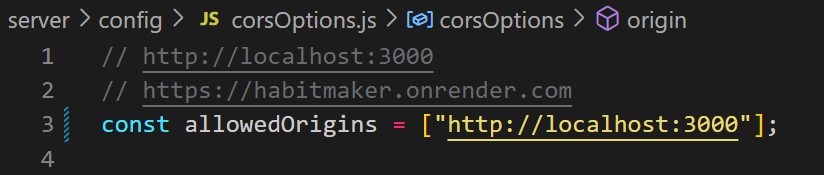

## About

Express server with REST API for MongoDB CRUD functions. 
Server for the habitmaker webapp. 
Can be found here: https://habitmaker.onrender.com

## Table of Contents

- [Local Setup](#local-setup)
- [Technologies Used](#technologies-used)
- [Credits](#credits)

## Local Usage

For the entire application to work, you must run the habitMaker-client in a separate terminal. You can find the code [here](https://github.com/naturalneuralnet/habitBuilder-client)

__Changes before local usage:__
Inside config/corsOptions.js change the allowedOrigins endpoint to the one you are running the client on. For example:

Run `npm install` to install the project dependencies.

Run `npm run dev`to run the server locally. 

**Enviroment Variables:**
You will also need to add enviroment variables in a .env file

- MONGO_URL: A mongodb atlas url
- ACCESS_TOKEN_SECRET: A SSH key, can be generated with the ssh-keygen  command in the terminal. 
- REFRESH_TOKEN_SECRET:A SSH key, can be generated with the ssh-keygen command in the terminal. 
- VERIFICATION_EMAIL: This must be an outlook email address. To use other email providers, adjust the nodemailer config. 
- VERIFICATION_EMAIL_PASSWORD:Verification email address password.

## Technologies

- Node.js
- Express
- MongoDb
- Mongoose
- JSON Web Tokens
- CORS
- Nodemailer

## Credit

**Coding Resources:**
- Dave Grey's MERN stack tutorial on [YouTube](https://www.youtube.com/watch?v=CvCiNeLnZ00) and [GitHub](https://github.com/gitdagray/mern_stack_course)
- Sending Emails with NodeMailer Tutorial on [BetterProgramming](https://betterprogramming.pub/how-to-create-a-signup-confirmation-email-with-node-js-c2fea602872a)

## License

You can find the License for this project [here](LICENSE.md)

This project is licensed under the terms of the MIT license.

